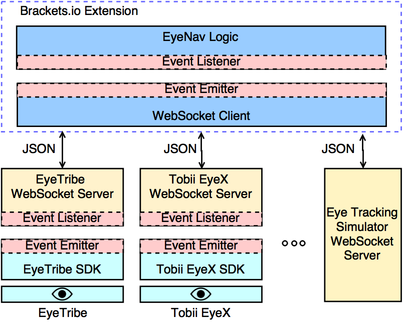

## Synopsis

**EyeNav** is a Brackets.io plugin that allows you to do simple navigation in the editor using an eye-tracking device. It allows you to scroll, click, select text, and more using your eyes and keyboard shortcuts.

## Demo

A demo video of EyeNav is available on [YouTube](https://youtu.be/AkDyx2l-YGk).

## Installation

As EyeNav is a Brackets.io extension, the plugin is delivered through the [Brackets.io Extension Registry](https://brackets-registry.aboutweb.com/). 
After installing EyeNav from the extension manager, there are 2 more steps left to navigating code with your eyes!

* Install the SDK for your eye tracker
* Install/Run the websocket server that wraps the SDK for your tracker.

There are currently 2 popular eye trackers aimed at the mass market, and we provide a websocket server for both of them.

#### EyeTribe 
Install information can be found at: [EyeTribe Getting Started](http://dev.theeyetribe.com/start/). 
The EyeTribe WebSocket Server can be found: [EyeTribe Web Socket Server](https://github.com/sradevski/EyeTribe-Web-Socket-Server)

#### Tobii EyeX
Install information can be found at: [Tobii EyeX Getting Started](http://developer.tobii.com/eyex-setup/). 
The Tobii EyeX WebSocket Server can be found at: [Tobii EyeX Web Socket Server](https://github.com/sradevski/Tobii-EyeX-Web-Socket-Server)

#### Simulator
If, for any reason, you want to use a simulator websocket server, you can find it at: [EyeNav Eye Tracker Simulator](https://github.com/sradevski/EyeNav-WebSocket-EyeTracker-Simulator).

You can also easily create a websocket server by yourself for any device and you can start using EyeNav in no time. You can refer to the code for either Tobii EyeX and EyeTribe to get an idea how they are implemented and what data format EyeNav expects from the servers.

## Usage

After installing EyeNav and the dependencies as described above, it is time to start using it! EyeNav will be located in the right-side bar menu (look for an eye!). Before running EyeNav, you should run the eye tracker server and the websocket server for your device. The menu icon is color coded, so it gives you immediate feedback on the state of EyeNav. EyeNav can be in one of the following states:

* **Gray**: EyeNav is not activated
* **Red**: EyeNav is activated, but it isn't/can not connect to the websocket server.
* **Green**: EyeNav is connected to the server, but it isn't getting valid gaze data(or any data at all)
* **Blue**: EyeNav is getting gaze data and it is ready to use.

If everything works well, you can start the magic just by pressing some keyboard shortcuts. The general shortcut pattern is **Trigger Key** + *(Modifier Key)* + **Command Key**, pressed in the listed order. The trigger key essentially switches the keyboard key meaning between standard key functions and EyeNav-related functions.

#### Trigger:

Key | Action
--- | ------
'Right Alt' | Trigger EyeNav functionalities

#### Modifiers:

Key | Action
--- | ------
'Shift' | Select text with any command that moves the caret
'.' | Manual gaze calibration (works with WASD commands)

#### Commands:

Key | Action
--- | ------
'Q' | Move caret at gaze location
'R' | Move caret along its current line at gaze x location
'F' | Move caret along its current column at gaze y location
'Z' | Scroll in gaze direction relative to the center of the editor
'W' | Mapping for the Up Arrow key
'A' | Mapping for the Left Arrow key
'S' | Mapping for the Down Arrow key
'D' | Mapping for the Right Arrow key

## Architecture

In order to make EyeNav as flexible and extensible as possible, we decided to make the eye tracker and EyeNav talk through Web Sockets (see figure below). This means EyeNav can work for any eye tracker as long as you create a wrapper over its SDK.



## Preferences

You can change the key shortcuts and the port and address of the websocket server by modifying the Brackets.io preferences file. 

If you wish to change the port and IP address of the websocket server, you can use the following options (the one below are the default options):

```javascript
"eyeNav.ipAddress": "127.0.0.1",
"eyeNav.port": 8887
```

You can also change the keyboard shortcuts for each command. In order to see which keys are possible, please refer to the [KeyManager](src/keyManager.js) file. Even though the keys are separated in 3 objects depending on their function, you can treat them as one when writing your desired options. In order to get the keyCode and location you can use the following [JsBin](http://jsbin.com/gidigi/1). btnName is used just for reference so there isn't a right format in specifying it as of now. Note that Brackets.io has some limitations on [which keys can be used](https://github.com/adobe/brackets/wiki/User-Key-Bindings). An example keys option: (you must use double quotes)

```javascript
"eyeNav.keys": {
  "textSelection": {
    "keyCode": 16,
    "location": [1,2],
    "btnName": "Shift"
  },
  "click": {
    "keyCode": 81,
    "location": [0],
    "btnName": "Q"
  }
}
```

## Contributors

EyeNav has been developed at Nara Institute of Science and Technology (NAIST), Software Engineering Laboratory.

If anyone is interested in improving EyeNav and contributing, please contact me directly. If there is some interest I will create a guide on how to contribute, but it is not necessary at this stage. You can report any bugs or feature requests at: [EyeNav Trello](https://trello.com/b/exmrboqr/eyenav). 

## License

This project is under the [MIT Licence](LICENSE)
